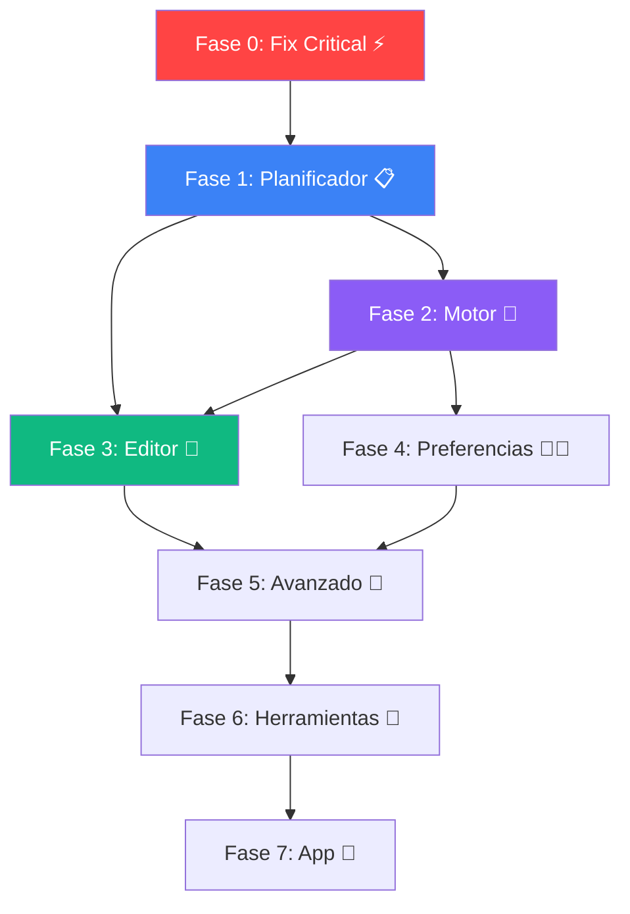

# Sistema de Horarios Inspirado en Peñalara GHC — Plan Completo por Fases

## Resumen

Basándome en los **38 videotutoriales** de [Peñalara GHC](https://www.penalara.com/en/videotutorials#v2) y el análisis completo del código actual, he diseñado un plan por fases para construir un sistema de horarios completo. Peñalara GHC se estructura en **3 componentes principales**:

1. **Planificador** (Planner) — Donde se definen los datos del horario
2. **Motor** (Engine) — El algoritmo que resuelve el horario
3. **Editor** — Donde se visualiza, edita y exporta el resultado

---

## 🔴 Diagnóstico: ¿Por qué no funciona actualmente?

> [!CAUTION]
> La solución **NO COMPILA** actualmente. El test unitario `EntityTests.cs` referencia la estructura antigua de `Schedule` (con `Subject = "string"`, `DayOfWeek`, `StartTime`, `EndTime`) que ya fue reestructurado para usar `SubjectId`, `TimeSlotId`, etc.

### Errores encontrados

| Archivo | Error | Causa |
|---------|-------|-------|
| [EntityTests.cs](file:///d:/Personal/Colegio/tests/Colegio.Api.Tests/UnitTests/EntityTests.cs#L95-L111) | `CS0029`, `CS0117`, `CS1061` | El test `Schedule_ShouldHaveCorrectTimeProperties` usa la estructura **antigua** de `Schedule` (propiedades `Subject` como string, `DayOfWeek`, `StartTime`, `EndTime` directamente en la entidad). Desde la refactorización, Schedule usa `SubjectId` → `Subject` (entidad), `TimeSlotId` → `TimeSlot` (entidad con `DayOfWeek`, `StartTime`, `EndTime`). |

### Problemas adicionales detectados (potenciales)

| Componente | Problema | Impacto |
|------------|----------|---------|
| **Frontend API URL** | `api.ts` apunta a `http://localhost:8080` pero `Program.cs` no configura ese puerto explícitamente | El backend puede arrancar en otro puerto (5180 según conversación anterior) |
| **NoTracking + Seed** | `DbContext` tiene `NoTracking` por defecto pero el seed hace `AddRange` → potencial conflicto si se llama dos veces | Seed puede fallar en re-ejecución |
| **Currículo incompleto** | Solo se definen currículum para Primary3-6, ESO1-4, Bachillerato1-2. Faltan Infantil | El motor falla para aulas de Infantil: `"No se encontró un horario válido"` |
| **Motor de generación** | El backtracking explora todas las combinaciones secuencialmente → exponencialmente lento para 30 aulas | Timeout al generar para todo el centro |

---

## Mapa de Videotutoriales → Fases de Implementación

| Vídeo | Título | Fase |
|-------|--------|------|
| 1-5 | Introducción, primeros pasos, motor básico | Fase 0 + 1 |
| 6 | Marco temporal del horario | Fase 1 |
| 7 | Horarios diferentes cada semana | Fase 5 (avanzada) |
| 8 | Configuración de aulas | Fase 1 |
| 9-10 | Unidades de clase y sus propiedades | Fase 1 |
| 11 | Opciones de profesores | Fase 4 |
| 12 | Unidades no-lectivas | Fase 5 |
| 13 | Subgrupos | Fase 5 |
| 14-15 | Motor avanzado + depuración | Fase 2 |
| 16-18 | Editor visual | Fase 3 |
| 19-21 | Centros especiales, grupos mixtos | Fase 5 |
| 22-24 | Import/export, asistente, plataforma | Fase 6 |
| 25 | Juntas de evaluación | Fase 5 |
| 26-30 | App Web/Mobile, ausencias, reservas | Fase 7 |
| 31-32 | Captura de preferencias | Fase 4 |

---

## Fase 0: Fix Critical — Hacer que compile y funcione ⚡

> [!IMPORTANT]
> **Esta fase es imprescindible**. Sin ella nada más puede avanzar.

### Backend

#### [MODIFY] [EntityTests.cs](file:///d:/Personal/Colegio/tests/Colegio.Api.Tests/UnitTests/EntityTests.cs)
- Reescribir `Schedule_ShouldHaveCorrectTimeProperties` para usar la estructura actual:
  - `SubjectId` (Guid) en vez de `Subject` (string)
  - `TimeSlotId` (Guid) en vez de propiedades directas `DayOfWeek`, `StartTime`, `EndTime`
  - Verificar las relaciones de navegación están bien configuradas

#### [VERIFY] Puerto del backend
- Confirmar puerto en `launchSettings.json` y alinear con `api.ts` del frontend

### Frontend

#### [VERIFY] Compilación del frontend
- `npm run build` en `/web` para verificar que compila sin errores TypeScript

### Verificación
```bash
dotnet build        # ✅ debe compilar sin errores
dotnet test         # ✅ todos los tests deben pasar
cd web && npm run build  # ✅ frontend compila
```

---

## Fase 1: Planificador — Datos Base del Horario 📋

*Inspirada en vídeos 4-10 de Peñalara: Marco temporal, aulas, grupos, unidades de clase*

### 1.1 Marco Temporal Configurable (Vídeo 6)
Actualmente los TimeSlots están hardcodeados en el Seed. En GHC, el marco temporal es configurable.

#### [NEW] `TimetableFramework.cs` (Domain Entity)
```csharp
public class TimetableFramework {
    public Guid Id { get; set; }
    public string Name { get; set; }              // "Horario Estándar 2025-2026"
    public AcademicSessionType SessionType { get; set; }
    public bool HasAfternoon { get; set; }         // ¿Tiene sesión de tarde?
    public TimeSpan MorningStart { get; set; }     // 09:00
    public TimeSpan MorningEnd { get; set; }       // 13:00  
    public TimeSpan? AfternoonStart { get; set; }  // 15:00
    public TimeSpan? AfternoonEnd { get; set; }    // 17:00
    public int SessionDurationMinutes { get; set; } // 60 (duración estándar de cada sesión)
    public List<BreakDefinition> Breaks { get; set; } // Recreos configurables
}

public class BreakDefinition {
    public Guid Id { get; set; }
    public TimeSpan StartTime { get; set; }
    public TimeSpan EndTime { get; set; }
    public string Label { get; set; }              // "Recreo", "Comida"
}
```

- Los `TimeSlot` se **auto-generan** a partir del Framework
- UI: Formulario para definir la jornada con preview visual

#### [NEW] API: `TimetableFrameworkEndpoints.cs`
- CRUD + endpoint `POST /api/frameworks/{id}/generate-slots` para generar TimeSlots

### 1.2 Unidades de Clase (Class Units) — Vídeos 9, 10
Lo que en tu sistema actual es `Curriculum` + `Schedule`. En GHC, una "unidad de clase" (class unit) es la combinación:
- **Grupo** (classroom) + **Asignatura** (subject) + **Profesor** (teacher) + **Nº sesiones semanales** + **Propiedades**

#### [NEW] `ClassUnit.cs` (Domain Entity)
```csharp
public class ClassUnit {
    public Guid Id { get; set; }
    public Guid ClassroomId { get; set; }
    public Guid SubjectId { get; set; }
    public Guid? TeacherId { get; set; }           // Puede asignarse manual o por el motor
    public int WeeklySessions { get; set; }        // Nº sesiones por semana
    public int SessionDuration { get; set; }       // 1 o 2 horas (sesiones dobles)
    
    // Propiedades (Vídeo 10)
    public bool ConsecutiveDays { get; set; }      // Sesiones en días consecutivos
    public bool NonConsecutiveDays { get; set; }   // NO en días consecutivos
    public bool AllowDoubleSession { get; set; }   // Permitir sesión doble
    public Guid? PreferredRoomId { get; set; }     // Aula preferida
    
    // Simultaneous class units (mismo timeslot)
    public Guid? SimultaneousGroupId { get; set; } // Para agrupar unidades simultáneas
}
```

- Reemplaza el rol de `Curriculum` como fuente de "qué debe enseñarse"
- El `Curriculum` sigue existiendo como plantilla, pero `ClassUnit` es la instancia concreta

#### [NEW] UI: Página "Unidades de Clase"
- Tabla con filtros por grupo/asignatura/profesor
- Creación masiva desde el Curriculum (asistente)
- Edición inline de propiedades

### 1.3 Configuración de Aulas (Vídeo 8)
El sistema de `Room` ya existe pero necesita ampliarse:

#### [MODIFY] [Room.cs](file:///d:/Personal/Colegio/src/Colegio.Domain/Entities/Room.cs)
- Añadir: `AnonymousGroup` (string?) — para aulas anónimas intercambiables (ej: "Aula genérica planta 1")
- En GHC: aulas **específicas** (Lab), **anónimas** (cualquier aula de un grupo) y **conjuntos de aulas**

#### [NEW] UI: CRUD de Aulas mejorado
- Con asignación visual de qué asignaturas usan qué aulas
- Indicador de ocupación por franja horaria

---

## Fase 2: Motor de Generación Mejorado 🔧

*Inspirada en vídeos 5, 14, 15: Motor, optimización, depuración*

### 2.1 Motor con Constraint Satisfaction Problem (CSP)

#### [REWRITE] [ScheduleGeneratorService.cs](file:///d:/Personal/Colegio/src/Colegio.Infrastructure/Services/ScheduleGeneratorService.cs)

El motor actual usa backtracking simple. GHC usa un motor sofisticado con:

**Algoritmo mejorado:**
1. **Pre-procesamiento**: Calcular dominio de cada ClassUnit (timeslots posibles)
2. **Propagación de restricciones (AC-3)**: Podar dominios imposibles antes de buscar
3. **Backtracking con heurísticas**:
   - **MRV** (Minimum Remaining Values): Asignar primero la unidad con menos opciones
   - **Forward Checking**: Tras cada asignación, propagar y podar
4. **Optimización por puntuación**: Una vez hallada una solución, intentar mejorarla intercambiando asignaciones
5. **Timeout configurable**: Si no encuentra solución en X segundos, devolver la mejor parcial

```csharp
public interface IScheduleEngine {
    Task<EngineResult> SolveAsync(EngineInput input, EngineOptions options, CancellationToken ct);
}

public record EngineInput(
    List<ClassUnit> ClassUnits,
    List<TimeSlot> TimeSlots,
    List<Teacher> Teachers,
    List<Room> Rooms,
    List<ScheduleConstraint> Constraints,
    List<Schedule> LockedSchedules       // Sesiones pre-fijadas
);

public record EngineOptions(
    int MaxSeconds = 30,                   // Timeout
    int MaxIterations = 100_000,           // Límite de iteraciones
    bool OptimizeAfterSolving = true,      // Intentar mejorar tras resolver
    EngineMode Mode = EngineMode.Normal
);

public enum EngineMode { 
    Normal,       // Resolver y optimizar
    Debug,        // Solo verificar factibilidad
    Validate      // Validar solución existente
}

public record EngineResult(
    bool Success,
    List<Schedule> Schedules,
    ScheduleScore Score,
    List<string> Warnings,
    EngineStatistics Stats              // Tiempo, iteraciones, nodos visitados
);
```

### 2.2 Depuración de Condiciones Imposibles (Vídeo 15)

GHC incluye un proceso de "purificación" que identifica por qué no se puede resolver:

#### [NEW] `ConstraintDebugger.cs`
- Analizar **cada restricción individualmente**
- Detectar combinaciones mutuamente exclusivas
- Sugerir relajaciones (ej: "Si cambias MaxDailyHours de Hard a Soft, hay solución")
- UI con semáforo: 🟢 factible, 🟡 factible si relajamos, 🔴 imposible

### 2.3 Progreso en Tiempo Real

#### [NEW] SignalR Hub: `ScheduleHub.cs`
- Emitir progreso de la generación: % completado, soluciones parciales, score actual
- Frontend muestra barra de progreso y estadísticas en tiempo real

---

## Fase 3: Editor Visual de Horarios 🎨

*Inspirada en vídeos 16, 17, 18: Editor, uso del editor, proyección de resultados*

### 3.1 Vistas Múltiples del Horario (Vídeo 16)
GHC ofrece múltiples perspectivas:

#### [NEW] Componentes React:

| Vista | Descripción |
|-------|-------------|
| `TimetableByGroup.tsx` | Horario de un grupo/aula (vista actual mejorada) |
| `TimetableByTeacher.tsx` | Horario personal de cada profesor |
| `TimetableByRoom.tsx` | Ocupación de cada aula física |
| `TimetableBySubject.tsx` | Dónde se imparte cada asignatura |
| `TimetableOverview.tsx` | Vista resumen de todo el centro |

- Tabs para alternar entre vistas
- Cada vista es una cuadrícula L-V × franjas horarias
- Colores por asignatura (ya existen en `Subject.Color`)

### 3.2 Drag & Drop (Vídeo 17)
Edición manual del horario generado:

#### [MODIFY] `TimetableGrid.tsx` → Reescritura completa
- **Drag**: Arrastrar una sesión de un slot a otro
- **Validación en vivo**: Al soltar, verificar que no hay conflictos (profesor/aula ocupados)
- **Intercambio**: Soltar sobre otra sesión = intercambiar posiciones
- **Lock/Unlock visual**: Click derecho → menú contextual
- **Undo/Redo**: Historial de cambios

```typescript
// API adicional necesaria:
schedulesApi.swap(scheduleId1: string, scheduleId2: string)
schedulesApi.move(scheduleId: string, newTimeSlotId: string)
schedulesApi.validateMove(scheduleId: string, newTimeSlotId: string)
```

### 3.3 Exportación (Vídeo 16)

#### [NEW] Endpoints de exportación:
- `GET /api/schedules/export/pdf?view=group&id={classroomId}` — PDF del horario
- `GET /api/schedules/export/excel?view=teacher&id={teacherId}` — Excel
- `GET /api/schedules/export/html` — HTML imprimible

---

## Fase 4: Opciones de Profesores y Preferencias 👨‍🏫

*Inspirada en vídeos 11, 31, 32: Opciones de profesores, captura de preferencias*

### 4.1 Opciones Avanzadas del Profesor (Vídeo 11)

#### [MODIFY] [Teacher.cs](file:///d:/Personal/Colegio/src/Colegio.Domain/Entities/Teacher.cs)
```csharp
// Nuevas propiedades
public int MaxGapsPerDay { get; set; }         // Máx huecos diarios
public int MinDailyHours { get; set; }         // Mín horas diarias
public bool PreferCompactSchedule { get; set; } // Prefiere sin huecos
public DayOfWeek? PreferredFreeDay { get; set;} // Día libre preferido
```

#### [MODIFY] [TeacherAvailability.cs](file:///d:/Personal/Colegio/src/Colegio.Domain/Entities/TeacherAvailability.cs)
- Ya tiene `AvailabilityLevel` (Available/Preferred/Undesired/Unavailable) ✅
- Añadir UI para que cada profesor marque sus preferencias en un grid visual

### 4.2 Captura de Preferencias (Vídeos 31, 32)
En GHC, los jefes de departamento capturan las preferencias de sus profesores:

#### [NEW] UI: "Captura de Preferencias"
- Grid semanal donde el profesor marca cada franja como: 🟢 Preferida / ⚪ Disponible / 🟡 Indeseable / 🔴 No disponible
- Resumen del departamento para el jefe de estudios

---

## Fase 5: Funciones Avanzadas 🚀

*Inspirada en vídeos 7, 12, 13, 19-21, 25*

### 5.1 Unidades No Lectivas (Vídeo 12)
Guardias, reuniones, actividades complementarias:

#### [NEW] `NonClassUnit.cs`
```csharp
public enum NonClassUnitType {
    OnCall,           // Guardia
    Meeting,          // Reunión de departamento
    CoordinationMeeting, // Reunión de coordinación
    Complementary,    // Actividad complementaria
    BreakSupervision  // Vigilancia de recreo
}
```
- Se generan junto con las class units
- Las guardias cubren huecos libres

### 5.2 Subgrupos (Vídeo 13)
Un grupo de alumnos puede pertenecer a varios grupos:

#### [NEW] `Subgroup.cs`
- Para desdobles (ej: Inglés nivel A / nivel B)
- El motor debe entender que un subgrupo no puede tener dos clases simultáneas

### 5.3 Grupos Mixtos (Vídeos 20, 21)
Alumnos de diferentes grados en un mismo grupo para ciertas asignaturas.

### 5.4 Juntas de Evaluación (Vídeo 25)
Generación automática de calendario de evaluaciones.

---

## Fase 6: Herramientas Auxiliares 🔧

*Inspirada en vídeos 22-24*

### 6.1 Importación/Exportación (Vídeo 22)
- Importar datos desde CSV/Excel
- Exportar configuración completa para backup

### 6.2 Asistente de Grupos (Vídeo 23)
- Wizard que genera automáticamente todas las ClassUnits a partir del currículo
- Gestiona optativas y desdobles

### 6.3 Impresión y Reportes
- PDF con el horario de cada grupo/profesor/aula
- HTML responsive para publicar en la web del colegio

---

## Fase 7: Aplicación Web/Móvil 📱

*Inspirada en vídeos 26-30*

### 7.1 Publicación del Horario (Vídeo 26)
- Vista pública (solo lectura) del horario para profesores y alumnos
- Filtrado por perfil: "mi horario"

### 7.2 Gestión de Ausencias (Vídeos 27, 28)
- Registro de ausencias de profesores
- Asignación automática de sustitutos (usando profesores de guardia)
- Notificaciones en tiempo real

### 7.3 Reserva de Aulas (Vídeo 29)
- Profesores pueden reservar aulas libres

### 7.4 Unidades Esporádicas (Vídeo 30)
- Clases extra fuera del horario publicado

---

## Prioridad y Dependencias



## Open Questions

> [!IMPORTANT]
> **¿Quieres que empiece directamente por la Fase 0** (arreglar la compilación) para que puedas ver la app funcionando cuanto antes?

> [!IMPORTANT]
> **Infantil (3, 4, 5 años)** — ¿Estos grados necesitan horario? Actualmente no tienen currículo definido en el seed, así que el motor falla para ellos. ¿Los excluimos del generador o añadimos su currículo?

> [!IMPORTANT]
> **¿Qué fases te interesan más?** El plan completo (7 fases) es un sistema muy grande. ¿Hay fases que quieras postergar o eliminar?

## Plan de Verificación

### Automatizado
- `dotnet build` — Compilación sin errores
- `dotnet test` — Tests unitarios e integración
- `npm run build` — Frontend compila
- Tests E2E con Playwright para el editor visual (Fase 3+)

### Manual
- Generar horario para un aula y verificar que no hay conflictos
- Probar drag & drop en el editor
- Exportar PDF y verificar formato
